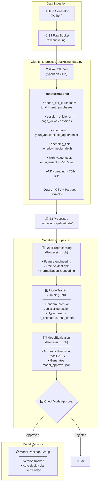
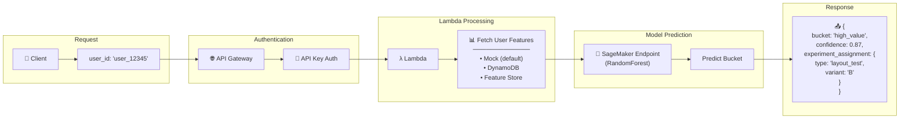
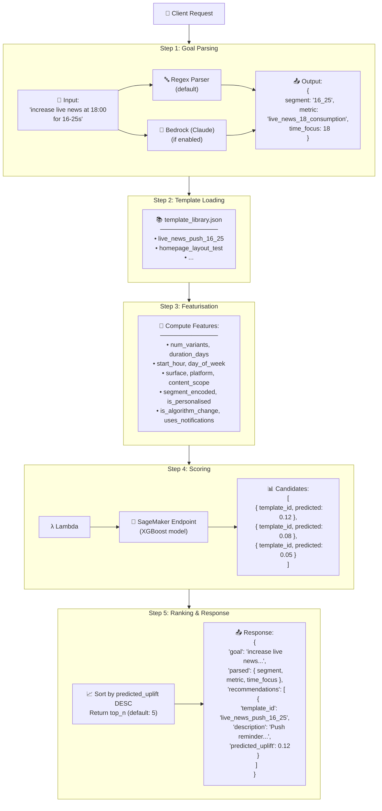

# AWS ML Platform

A modular AWS SageMaker platform that provides shared infrastructure for multiple ML pipelines that I'm testing out to learn more about Sagemaker and related systems on AWS.

## Overview

### User Bucketing Pipeline

Classifies users for experiment assignment using SageMaker pipelines



#### Real-Time Inference Flow



### ML Recommender Pipeline

Recommendation engine for suggesting experiments using historical uplift data

```mermaid
flowchart TB
    subgraph ingestion["Data Ingestion"]
        DG["🐍 Data Generator<br/>(Python)<br/>─────────────<br/>generates:<br/>• experiments<br/>• uplifts"]
        S3Raw["📦 S3 Raw Bucket<br/>experiments/<br/>• metadata/<br/>• results/"]
        DG --> S3Raw
    end

    subgraph etl["Glue ETL: process_experiment_data.py"]
        direction TB
        GlueJob["⚙️ Glue ETL Job<br/>(Spark on Glue)"]
        
        ETLDetails["<b>Transformations:</b><br/>
        • Join metadata + results on experiment_id<br/>
        • Aggregate per experiment:<br/>
          - total_observations, total_sample_size<br/>
          - avg_uplift_pct, stddev_uplift_pct<br/>
          - avg/max/min z_score<br/>
          - num_metrics, num_segments<br/>
        • experiment_duration_days: end - start<br/>
        • is_significant: |z_score| > 1.96<br/>
        • is_successful: significant AND uplift > 0<br/>
        • experiment_size: small/medium/large<br/>
        • experiment_length: short/medium/long<br/><br/>
        <b>Output:</b> CSV + Parquet formats"]
    end

    subgraph sagemaker["SageMaker Pipeline"]
        direction TB
        Preprocess["1️⃣ DataPreprocessing<br/>(Processing Job)<br/>─────────────<br/>• Join metadata + results<br/>• Extract features: num_variants,<br/>  duration, surface, platform, etc.<br/>• Calculate uplift percentages<br/>• Train/validation split"]
        Train["2️⃣ ModelTraining<br/>(Training Job)<br/>─────────────<br/>• XGBoost Regressor<br/>• max_depth=8, eta=0.05<br/>• subsample=0.8<br/>• num_boost_round=400<br/>• Predicts: uplift_pct"]
        Evaluate["3️⃣ ModelEvaluation<br/>(Processing Job)<br/>─────────────<br/>• RMSE ≤ 5.0<br/>• MAE ≤ 3.0<br/>• R² ≥ 0.6<br/>• Generates model_approval.json"]
        Condition{"4️⃣ CheckModelApproval"}
        
        Preprocess --> Train --> Evaluate --> Condition
    end

    subgraph registry["Model Registry"]
        ModelReg["📋 Model Package Group<br/>*-recommender-models<br/>─────────────<br/>• XGBoost artifact (model.bst)<br/>• Feature list (feature_list.pkl)<br/>• Auto-deploy via EventBridge"]
    end

    S3Raw --> GlueJob
    GlueJob --> ETLDetails
    ETLDetails --> S3Proc["📦 S3 Processed<br/>recommender-pipeline/data/"]
    S3Proc --> Preprocess
    Condition -->|Approved| ModelReg
    Condition -->|Rejected| Fail["❌ Fail"]
```



#### Real-Time Inference Flow



## Setup

See [SETUP.md](SETUP.md) for a full end-to-end deployment guide.

## Data Generation

Both pipelines use the unified `data-generator` tool:

```bash
# Generate all data locally
make generate-data

# Generate specific data types
make generate-experiment   # Experiment metadata for recommender
make generate-bucketing    # User data for bucketing

# Generate and upload to S3
make upload-data BUCKET=your-bucket-name
```

Or use the CLI directly:

```bash
cd data-generator
python main.py all                              # Generate both datasets
python main.py experiment --records 100000     # Generate 100k experiments
python main.py bucketing --records 50000       # Generate 50k users
python main.py all --upload --bucket my-bucket # Generate and upload to S3
```

## Usage

### User Bucketing Pipeline

1. **Generate Data**: `make generate-bucketing` creates synthetic user data
2. **Upload Data**: `make upload-bucketing-data BUCKET=your-bucket`
3. **Run Pipeline**: Execute the Step Functions workflow (recommended) or SageMaker pipeline directly
   - **Step Functions** (full flow): Runs Glue ETL → SageMaker Pipeline in sequence
   - **SageMaker only**: Assumes processed data already exists in S3
4. **Deploy Model**: Approved models are registered in Model Registry, auto-deployed to endpoint
5. **Bucket Users**: POST to `/bucket` endpoint with a user ID and API key

```typescript
const response = await fetch('https://your-api.execute-api.region.amazonaws.com/prod/bucket', {
  method: 'POST',
  headers: {
    'Content-Type': 'application/json',
    'x-api-key': process.env.BUCKETING_API_KEY
  },
  body: JSON.stringify({ user_id: userId })
});

/**
 * Example response:
 * {
    "user_id": "user_12345",
    "bucket": "high_value",
    "confidence": 0.87,
    "experiment_assignment": {
      "type": "layout_test",
      "variant": "B"
    },
    "features_used": {
      "engagement_score": 0.82,
      "total_spent": 245.50
    }
  * }
*/

const { bucket, experiment_assignment } = await response.json();

// Route user to appropriate experience
if (bucket === 'high_value') {
  showPremiumFeatures();
  trackExperiment(experiment_assignment.type, experiment_assignment.variant);
} else {
  showStandardFeatures();
}
```

### ML Recommender Pipeline

1. **Generate Data**: `make generate-experiment` creates synthetic experiment data
2. **Upload Data**: `make upload-experiment-data BUCKET=your-bucket`
3. **Run Pipeline**: Execute the Step Functions workflow (recommended) or SageMaker pipeline directly
   - **Step Functions** (full flow): Runs Glue ETL → SageMaker Pipeline in sequence
   - **SageMaker only**: Assumes processed data already exists in S3
4. **Deploy Model**: Approved models are registered in Model Registry, auto-deployed to endpoint
5. **Get Recommendations**: POST to `/recommend` endpoint with a goal and API key

```typescript
const response = await fetch('https://your-api.execute-api.region.amazonaws.com/prod/recommend', {
  method: 'POST',
  headers: {
    'Content-Type': 'application/json',
    'x-api-key': process.env.RECOMMENDER_API_KEY
  },
  body: JSON.stringify({ goal: 'increase live news at 18:00 for 16-25s', top_n: 3 })
});

/**
 * Example response:
 * {
    "goal": "increase live news at 18:00 for 16-25s",
    "parsed": {
      "segment": "16_25",
      "metric": "live_news_18_consumption",
      "time_focus": 18
    },
    "recommendations": [
      {
        "template_id": "live_news_push_16_25",
        "description": "Push reminder for Live News at 18:00 for 16–25s.",
        "predicted_uplift": 0.12
      }
    ]
 * }
*/

const { recommendations } = await response.json();

// Run the experiment
runExperiment(recommendations[0].template_id);
```

## Local Training

Train models locally for development:

```bash
# Train recommender model
make train-recommender

# Train bucketing model
make train-bucketing
```

## Configuration Options

### Feature Sources (User Bucketing)

The bucketing Lambda supports multiple feature sources, configured via environment variables:

| Source | Env Var Value | Description |
|--------|---------------|-------------|
| Mock | `FEATURE_SOURCE=mock` | Synthetic data for development (default) |
| DynamoDB | `FEATURE_SOURCE=dynamodb` | Real-time features from DynamoDB |
| Feature Store | `FEATURE_SOURCE=feature_store` | SageMaker Feature Store for ML features |

Additional configuration:
- `DYNAMODB_TABLE`: DynamoDB table name (default: `user-features`)
- `FEATURE_GROUP_NAME`: SageMaker Feature Group name (default: `user-bucketing-features`)

### Goal Parser (ML Recommender)

The recommender Lambda can parse goals using regex (fast) or Amazon Bedrock (flexible):

| Parser | Env Var | Description |
|--------|---------|-------------|
| Regex | `USE_BEDROCK_PARSER=false` | Fast, deterministic pattern matching (default) |
| Bedrock | `USE_BEDROCK_PARSER=true` | AI-powered natural language understanding |

When using Bedrock:
- `BEDROCK_MODEL_ID`: Model to use
- Requires appropriate IAM permissions for `bedrock:InvokeModel`

### Pipeline Stack Options

Both pipeline stacks support these optional configuration props:

| Prop | Default | Description |
|------|---------|-------------|
| `alertEmail` | - | Email address to receive SNS alerts for endpoint issues |
| `enableApiSecurity` | `true` | Enable API key authentication and usage plans |
| `enableScheduledRetraining` | `false` | Enable automatic weekly retraining via EventBridge |
| `retrainingSchedule` | `cron(0 2 ? * SUN *)` | Cron schedule for retraining (Sunday 2 AM UTC) |
| `enableModelAutoDeploy` | `true` | Auto-deploy approved models from Model Registry |

### S3 Lifecycle Policies

Storage stack includes lifecycle policies for cost optimization:

| Prefix | Policy |
|--------|--------|
| `*-pipeline/models/` | Intelligent Tiering at 30 days, Glacier at 90 days |
| `*-pipeline/data-capture/` | Delete after 30 days |
| `*-pipeline/training-outputs/` | Intelligent Tiering at 30 days, delete at 180 days |
| Logs | Glacier at 30 days, delete at 120 days |

### Frontend Configuration

After deployment, inject API configuration into the frontend:

```bash
cd frontend
node scripts/inject-config.js dev
```

This fetches API URLs and API keys from CloudFormation outputs. Or set manually:

```bash
BUCKETING_API_URL=https://... \
BUCKETING_API_KEY=... \
RECOMMENDER_API_URL=https://... \
RECOMMENDER_API_KEY=... \
node scripts/inject-config.js
```

## Adding New ML Pipelines

1. Create scripts in `sagemaker-scripts/your-pipeline/`:
   - `preprocess.py` - Data preprocessing
   - `train.py` - Model training
   - `evaluate.py` - Model evaluation and approval
   - `inference.py` - Inference handling

2. Add data generation in `data-generator/` if needed

3. Create a stack in `cdk/lib/stacks/pipelines/your-pipeline-stack.ts` using the shared constructs:
   - `SageMakerPipeline` - Training workflow
   - `Endpoint` - Model deployment with monitoring
   - `ApiSecurity` - API Gateway security
   - `ModelAutoDeploy` - Model Registry integration
   - `MLDashboard` - CloudWatch dashboard
   - `ScheduledRetraining` - Automated retraining

4. Import and instantiate it in `cdk/bin/cdk.ts`

```typescript
const yourPipeline = new YourPipelineStack(app, `${cfg.componentName}-YourPipeline-${envName}`, {
  env,
  environmentName: envName,
  componentName: cfg.componentName,
  vpc: network.vpc,
  securityGroup: network.sagemakerStudioSg,
  rawDataBucket: storage.rawDataBucket,
  processedDataBucket: storage.processedDataBucket,
  codeBucket: storage.codeBucket,
  dataKey: storage.kmsKey,
  pipelineRole: iam.pipelineRole,
  lambdaExecutionRole: iam.lambdaExecutionRole,
  alertEmail: 'alerts@example.com',
  enableScheduledRetraining: true,
});
```
