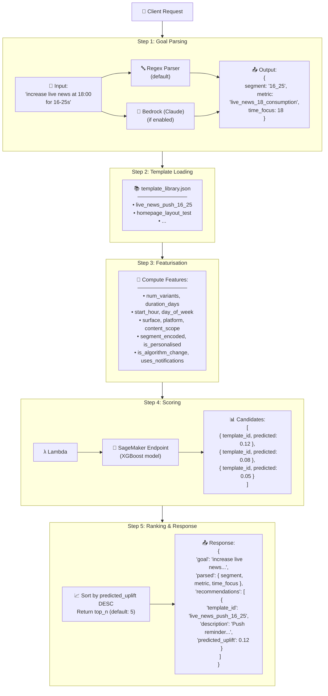

# ML Recommender Pipeline Architecture

```mermaid
flowchart TB
    subgraph ingestion["Data Ingestion"]
        DG["🐍 Data Generator<br/>(Python)<br/>─────────────<br/>generates:<br/>• experiments<br/>• uplifts"]
        S3Raw["📦 S3 Raw Bucket<br/>experiments/<br/>• metadata/<br/>• results/"]
        DG --> S3Raw
    end

    subgraph etl["Glue ETL: process_experiment_data.py"]
        direction TB
        GlueJob["⚙️ Glue ETL Job<br/>(Spark on Glue)"]

        ETLDetails["<b>Transformations:</b><br/>
        • Join metadata + results on experiment_id<br/>
        • Aggregate per experiment:<br/>
          - total_observations, total_sample_size<br/>
          - avg_uplift_pct, stddev_uplift_pct<br/>
          - avg/max/min z_score<br/>
          - num_metrics, num_segments<br/>
        • experiment_duration_days: end - start<br/>
        • is_significant: |z_score| > 1.96<br/>
        • is_successful: significant AND uplift > 0<br/>
        • experiment_size: small/medium/large<br/>
        • experiment_length: short/medium/long<br/><br/>
        <b>Output:</b> CSV + Parquet formats"]
    end

    subgraph sagemaker["SageMaker Pipeline"]
        direction TB
        Preprocess["1️⃣ DataPreprocessing<br/>(Processing Job)<br/>─────────────<br/>• Join metadata + results<br/>• Extract features: num_variants,<br/>  duration, surface, platform, etc.<br/>• Calculate uplift percentages<br/>• Train/validation split"]
        Train["2️⃣ ModelTraining<br/>(Training Job)<br/>─────────────<br/>• XGBoost Regressor<br/>• max_depth=8, eta=0.05<br/>• subsample=0.8<br/>• num_boost_round=400<br/>• Predicts: uplift_pct"]
        Evaluate["3️⃣ ModelEvaluation<br/>(Processing Job)<br/>─────────────<br/>• RMSE ≤ 5.0<br/>• MAE ≤ 3.0<br/>• R² ≥ 0.6<br/>• Generates model_approval.json"]
        Condition{"4️⃣ CheckModelApproval"}

        Preprocess --> Train --> Evaluate --> Condition
    end

    subgraph registry["Model Registry"]
        ModelReg["📋 Model Package Group<br/>*-recommender-models<br/>─────────────<br/>• XGBoost artifact (model.bst)<br/>• Feature list (feature_list.pkl)<br/>• Auto-deploy via EventBridge"]
    end

    S3Raw --> GlueJob
    GlueJob --> ETLDetails
    ETLDetails --> S3Proc["📦 S3 Processed<br/>recommender-pipeline/data/"]
    S3Proc --> Preprocess
    Condition -->|Approved| ModelReg
    Condition -->|Rejected| Fail["❌ Fail"]
```

## Real-Time Inference Flow

```mermaid
flowchart TB
    subgraph step1["Step 1: Goal Parsing"]
        Input["📝 Input:<br/>'increase live news at 18:00<br/>for 16-25s'"]
        Regex["🔤 Regex Parser<br/>(default)"]
        Bedrock["🧠 Bedrock (Claude)<br/>(if enabled)"]
        ParsedOutput["📤 Output:<br/>{<br/>  segment: '16_25',<br/>  metric: 'live_news_18_consumption',<br/>  time_focus: 18<br/>}"]

        Input --> Regex
        Input --> Bedrock
        Regex --> ParsedOutput
        Bedrock --> ParsedOutput
    end

    subgraph step2["Step 2: Template Loading"]
        Templates["📚 template_library.json<br/>─────────────<br/>• live_news_push_16_25<br/>• homepage_layout_test<br/>• ..."]
    end

    subgraph step3["Step 3: Featurisation"]
        Features["🔢 Compute Features:<br/>─────────────<br/>• num_variants, duration_days<br/>• start_hour, day_of_week<br/>• surface, platform, content_scope<br/>• segment_encoded, is_personalised<br/>• is_algorithm_change, uses_notifications"]
    end

    subgraph step4["Step 4: Scoring"]
        Lambda["λ Lambda"]
        Endpoint["🤖 SageMaker Endpoint<br/>(XGBoost model)"]
        Candidates["📊 Candidates:<br/>[<br/>  { template_id, predicted: 0.12 },<br/>  { template_id, predicted: 0.08 },<br/>  { template_id, predicted: 0.05 }<br/>]"]

        Lambda --> Endpoint --> Candidates
    end

    subgraph step5["Step 5: Ranking & Response"]
        Rank["📈 Sort by predicted_uplift DESC<br/>Return top_n (default: 5)"]
        Response["📤 Response:<br/>{<br/>  'goal': 'increase live news...',<br/>  'parsed': { segment, metric, time_focus },<br/>  'recommendations': [<br/>    {<br/>      'template_id': 'live_news_push_16_25',<br/>      'description': 'Push reminder...',<br/>      'predicted_uplift': 0.12<br/>    }<br/>  ]<br/>}"]

        Rank --> Response
    end

    Client["👤 Client Request"] --> step1
    step1 --> step2
    step2 --> step3
    step3 --> step4
    step4 --> step5
```
