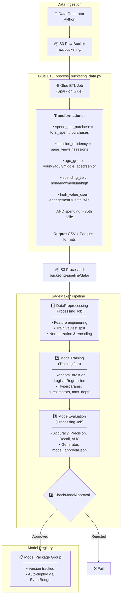
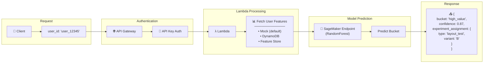

# User Bucketing Pipeline Architecture - Architecture

```mermaid
flowchart TB
    subgraph ingestion["Data Ingestion"]
        DG["🐍 Data Generator<br/>(Python)"]
        S3Raw["📦 S3 Raw Bucket<br/>raw/bucketing/"]
        DG --> S3Raw
    end

    subgraph etl["Glue ETL: process_bucketing_data.py"]
        direction TB
        GlueJob["⚙️ Glue ETL Job<br/>(Spark on Glue)"]

        ETLDetails["<b>Transformations:</b><br/>
        • spend_per_purchase = total_spent / purchases<br/>
        • session_efficiency = page_views / sessions<br/>
        • age_group: young/adult/middle_aged/senior<br/>
        • spending_tier: none/low/medium/high<br/>
        • high_value_user: engagement > 75th %ile<br/>
          AND spending > 75th %ile<br/><br/>
        <b>Output:</b> CSV + Parquet formats"]
    end

    subgraph sagemaker["SageMaker Pipeline"]
        direction TB
        Preprocess["1️⃣ DataPreprocessing<br/>(Processing Job)<br/>─────────────<br/>• Feature engineering<br/>• Train/val/test split<br/>• Normalization & encoding"]
        Train["2️⃣ ModelTraining<br/>(Training Job)<br/>─────────────<br/>• RandomForest or LogisticRegression<br/>• Hyperparams: n_estimators, max_depth"]
        Evaluate["3️⃣ ModelEvaluation<br/>(Processing Job)<br/>─────────────<br/>• Accuracy, Precision, Recall, AUC<br/>• Generates model_approval.json"]
        Condition{"4️⃣ CheckModelApproval"}

        Preprocess --> Train --> Evaluate --> Condition
    end

    subgraph registry["Model Registry"]
        ModelReg["📋 Model Package Group<br/>─────────────<br/>• Version tracked<br/>• Auto-deploy via EventBridge"]
    end

    S3Raw --> GlueJob
    GlueJob --> ETLDetails
    ETLDetails --> S3Proc["📦 S3 Processed<br/>bucketing-pipeline/data/"]
    S3Proc --> Preprocess
    Condition -->|Approved| ModelReg
    Condition -->|Rejected| Fail["❌ Fail"]
```

## Real-Time Inference Flow

```mermaid
flowchart LR
    subgraph request["Request"]
        Client["👤 Client"]
        UserID["user_id: 'user_12345'"]
    end

    subgraph auth["Authentication"]
        API["🌐 API Gateway"]
        APIKey["🔑 API Key Auth"]
    end

    subgraph processing["Lambda Processing"]
        Lambda["λ Lambda"]
        Features["📊 Fetch User Features<br/>─────────────<br/>• Mock (default)<br/>• DynamoDB<br/>• Feature Store"]
    end

    subgraph prediction["Model Prediction"]
        Endpoint["🤖 SageMaker Endpoint<br/>(RandomForest)"]
        Predict["Predict Bucket"]
    end

    subgraph response["Response"]
        Output["📤 {<br/>  bucket: 'high_value',<br/>  confidence: 0.87,<br/>  experiment_assignment: {<br/>    type: 'layout_test',<br/>    variant: 'B'<br/>  }<br/>}"]
    end

    Client --> UserID --> API
    API --> APIKey --> Lambda
    Lambda --> Features --> Endpoint
    Endpoint --> Predict --> Output
```
